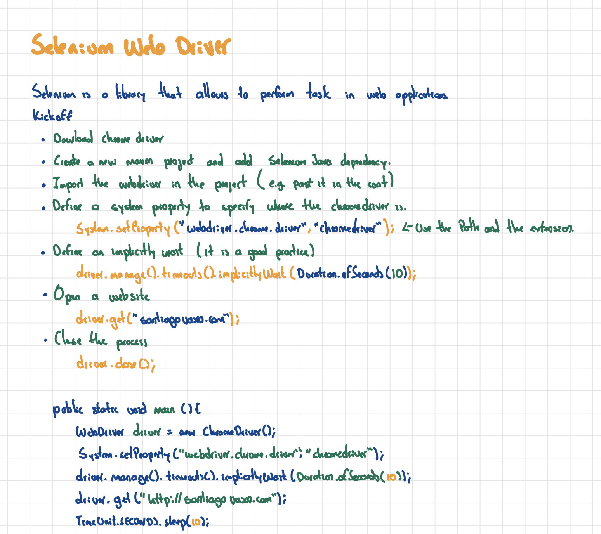

# Selenium-demo
This is a project where the practical classes of the [Automation Testing Masterclass](https://www.udemy.com/course/automation-testing-masterclass/) are implemented.

### Sections:
 * Kickoff:
   * [Kickoff](src/main/java/selenium/kickoff/Kickoff.java) Setting up the webdriver and open a web page.
   * [Locators](src/main/java/selenium/kickoff/Locators.java) Finding elements in the DOM using locators.
 * Actions:
   * [GetText](src/main/java/selenium/actions/GetText.java) How to get the text of a web element.
   * [ClickOnElement](src/main/java/selenium/actions/ClickOnElement.java) How to click on a button.
   * [SendText](src/main/java/selenium/actions/SendText.java) Example of how to write text in an input field.
   * [WorkWithTables](src/main/java/selenium/actions/WorkWithTables.java) How to get info from a table.
   * [SelectExample](src/main/java/selenium/actions/SelectExample.java) How to select an option from a Select component. 
   * [ActionsExample](src/main/java/selenium/actions/ActionsExample.java) How to perform actions as drag and drop elements, do a right click.
 * Waits:
   * [WaitTypes](src/main/java/selenium/waits/WaitTypes.java) Different types of waits.
 * JavaScriptExecutor:
   * [JavascriptExecutorExamples](src/main/java/selenium/javascriptexecutor/JavascriptExecutorExamples.java) Some examples about executing javascript code.
 * Alerts:
   * [Alerts](src/main/java/selenium/alerts/Alerts.java) Example about how to handler alerts.
 * iFrames:
   * [WorkWithIframes](src/main/java/selenium/iframes/WorkWithIframes.java) How to work with iFrames.

To organize the project structure, the creation of the WebDriver is implemented in a utility class, alongside the Wikipedia URL that is used in many examples.
```java
 public static final String WIKIPEDIA_URL= "https://www.wikipedia.org/";

 public static WebDriver getDriver() {
        WebDriver driver = new ChromeDriver();
        System.setProperty("webdriver.chrome.driver", "chromedriver");
        driver.manage().timeouts().implicitlyWait(Duration.ofSeconds(10));
        driver.manage().window().maximize();
        return driver;
    }
```
### Notes
This is a PDF with some notes and examples, it is pretty much the same content.
[](notes/Automation-Testing-Notes.pdf)